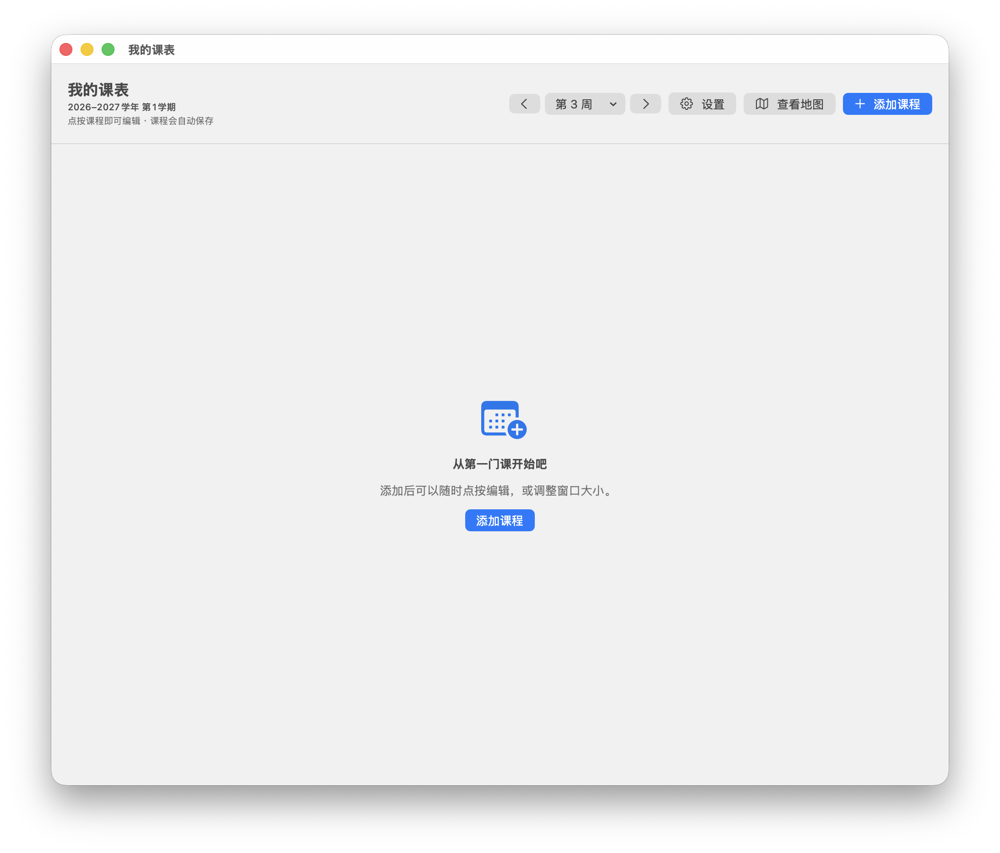
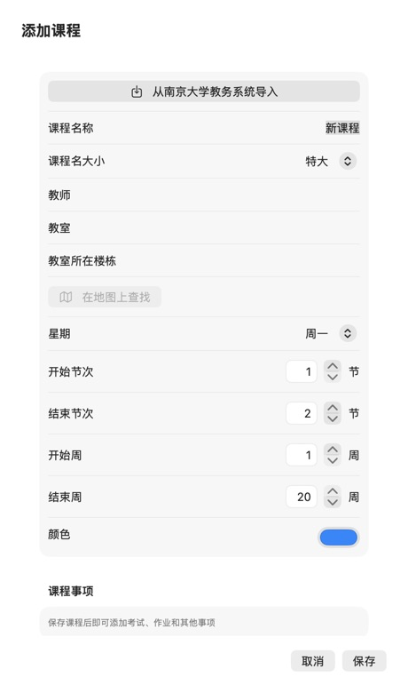
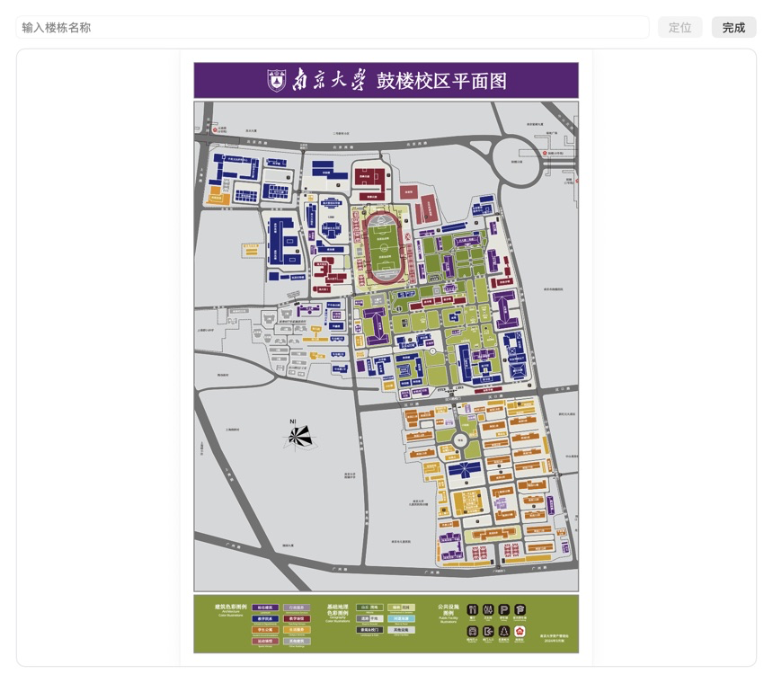

# 我的课表

一款面向南京大学课程安排而生的原生 macOS 课表应用。
它把每周课程、考试、作业、校园地图和日历导出集中在一个简洁的桌面窗口中，数据默认保存在本机。



## 功能

- 按周查看课表，自动显示当前周和每天日期，可一键返回本周。
- 支持课程名称、教师、教室、教室所在楼栋查找、节次、周次和自定义颜色。
- 登录南京大学教务系统后读取课表，不会自动提交登录表单。
- 内置南京大学鼓楼校区地图，可按楼栋名称定位、居中和高亮。
- 为课程添加考试、作业与其他事项，支持确认完成状态及未来 7 天待办事项提醒。
- 逾期事项显示红色，当天事项显示橙色。
- 可导出高清 PNG图片、PDF文件、ICS日历文件，或同步到苹果日历。
- 同时支持 Apple 芯片与 Intel 芯片 Mac。

| 添加和编辑课程 | 校园地图 |
| --- | --- |
|  |  |

## 系统要求

- macOS 14 Sonoma 或更高版本。
- 使用教务导入功能时需要网络连接和南京大学统一身份认证账号。
- 同步苹果日历时需要授予日历权限。

## 安装

1. 在仓库右侧的 **Releases** 中下载最新的 `我的课表-x.y.z.dmg`。
2. 打开 DMG，把“我的课表”拖到“应用程序”。
3. 从“应用程序”文件夹打开。

正式 Release 应使用 Developer ID 签名并通过苹果公证。未经公证的测试包可能触发 macOS Gatekeeper 警告。

## 从源码构建

需要完整安装 Xcode。在仓库根目录运行：

```bash
./scripts/build-release.sh
./scripts/create-dmg.sh
```

生成内容位于 `dist/`。默认构建使用临时签名；正式发布时通过环境变量提供签名信息：

```bash
SIGNING_IDENTITY="Developer ID Application: Your Name (TEAMID)" \
BUNDLE_ID="com.example.myschedule" \
VERSION="1.0.0" \
./scripts/build-release.sh
```

## GitHub 自动发布

`.github/workflows/release.yml` 会在推送 `v*` 标签时构建通用应用、制作 DMG、提交苹果公证并创建 GitHub Release。启用前需要配置：

### Repository variables

- `BUNDLE_ID`：长期不变的正式 Bundle ID。

### Actions secrets

- `DEVELOPER_ID_APPLICATION_P12_BASE64`
- `DEVELOPER_ID_APPLICATION_PASSWORD`
- `DEVELOPER_ID_APPLICATION_IDENTITY`
- `NOTARY_APPLE_ID`
- `NOTARY_TEAM_ID`
- `NOTARY_PASSWORD`：Apple Account 的 App 专用密码。

证书与密码不要提交到仓库。

## 数据与隐私

课程和事项保存在本机。
应用不包含广告或行为分析；教务系统页面直接连接南京大学网站。详细说明见 [PRIVACY.md](PRIVACY.md)。

## 开源许可

源代码采用 [MIT License](LICENSE)。校园地图文件不包含在 MIT 授权范围内，公开发布前请阅读 [THIRD_PARTY_NOTICES.md](THIRD_PARTY_NOTICES.md) 并确认再分发许可。

## 安全问题

请不要在公开 Issue 中上传账号、密码、Cookie 或个人课表。报告安全问题前请阅读 [SECURITY.md](SECURITY.md)。
